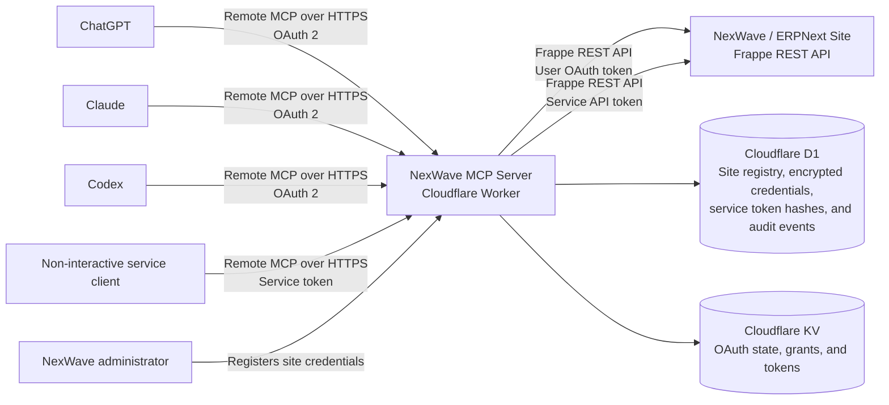

# NexWave MCP

NexWave MCP is a small, self-hosted gateway that connects AI clients such as ChatGPT, Claude, and Codex to a NexWave or ERPNext site.

It uses standard MCP with OAuth 2 for interactive users and Frappe API tokens for non-interactive service clients. It does not need a custom Frappe app and does not use `frappe_assistant_core`.

## Live POC

| Service | URL |
| --- | --- |
| MCP endpoint | `https://mcp.highflyertech.co.nz/mcp` |
| Service MCP endpoint | `https://mcp.highflyertech.co.nz/service/mcp` |
| Site setup | `https://mcp.highflyertech.co.nz/admin` |
| Health check | `https://mcp.highflyertech.co.nz/health` |

The setup page requires the private `ADMIN_TOKEN` Worker secret. Registered site names and URLs remain private.

## Architecture



The Worker is the protocol and security boundary between each AI client and each NexWave site.

| Component | Responsibility |
| --- | --- |
| MCP client | Discovers the server, authenticates, and calls tools |
| Cloudflare Worker | Handles MCP, OAuth, tool validation, and Frappe REST requests |
| D1 | Stores the private site registry, encrypted OAuth or API-token credentials, service token hashes, and sign-in audit events |
| KV | Stores short-lived OAuth state, grants, and MCP tokens |
| NexWave site | Authenticates the user and applies normal Frappe permissions |

## Authentication and request flow

1. The MCP client discovers the protected resource and OAuth metadata from the Worker.
2. The Worker asks the user for their exact NexWave site URL. It does not show a list of registered sites.
3. The Worker matches the URL origin against its private D1 registry.
4. The browser moves to the selected NexWave site for Frappe OAuth approval with PKCE S256.
5. After approval, the Worker returns control to the MCP client and issues an MCP token with the `nexwave:read` scope.
6. Each tool call uses the signed-in user's Frappe access token. Frappe applies that user's roles and document permissions.

Non-interactive clients can use the separate `/service/mcp` route. When an administrator registers a fixed API-token site, the Worker verifies the Frappe credentials and returns a generated service token once. It stores only the service-token hash and encrypted Frappe credentials in D1. A service client sends the generated token in the `X-NexWave-Service-Token` header. This route exposes the same read-only tool catalogue as `/mcp`.

## Connect a client

Use this remote MCP endpoint in a client that supports OAuth-enabled remote MCP servers:

```text
https://mcp.highflyertech.co.nz/mcp
```

For Codex CLI and the Codex desktop app:

```sh
codex mcp add nexwave --url https://mcp.highflyertech.co.nz/mcp
codex mcp login nexwave
codex mcp get nexwave
```

The browser will ask for the NexWave site URL and then show that site's normal Frappe sign-in and access approval screens.

### Connect a non-interactive service client

Use the service endpoint when a client cannot complete an interactive OAuth flow:

```text
https://mcp.highflyertech.co.nz/service/mcp
```

Configure this request header:

```text
X-NexWave-Service-Token: <generated-service-token>
```

Add the site at `/admin`, select **Fixed API token**, and enter the API key and secret of a dedicated NexWave user. Copy the generated service token when the connection is saved. The same site URL can have one OAuth connection and one fixed-token connection. The gateway token is not a Frappe credential. The Worker uses its hash to select the registered site, decrypts the stored Frappe API token, and applies that service user's normal roles and permissions.

## Available tools

All tools are read-only. List results and report output are bounded to keep MCP responses manageable.

### Connection and master data

| Tool | Purpose |
| --- | --- |
| `get_current_user` | Show the connected site and user |
| `list_companies` | List accessible companies |
| `list_customers` | Search customers |
| `list_suppliers` | Search suppliers |
| `list_items` | Search items |
| `list_warehouses` | List company warehouses |
| `list_accounts` | List company ledger accounts |
| `list_cost_centres` | List company cost centres |
| `list_projects` | List company projects |
| `list_fiscal_years` | List enabled fiscal years |

### Transactions

| Tool | Purpose |
| --- | --- |
| `list_sales_orders` | List sales orders |
| `list_sales_invoices` | Search and filter sales invoices |
| `list_purchase_orders` | Search and filter purchase orders |
| `list_purchase_invoices` | Search and filter purchase invoices |
| `list_payments` | Search and filter payment entries |
| `list_bank_transactions` | Search and filter imported bank transactions |
| `get_document` | Get an allowlisted business document by exact name |

`get_document` supports Customer, Item, Sales Order, Sales Invoice, Purchase Order, Purchase Invoice, Payment Entry, and Bank Transaction.

### Reports

| Tool | Standard ERPNext report |
| --- | --- |
| `get_stock_balance` | Stock Balance |
| `get_stock_ledger` | Stock Ledger |
| `get_profit_and_loss` | Profit and Loss Statement |
| `get_trial_balance` | Trial Balance |
| `get_general_ledger` | General Ledger |
| `get_accounts_receivable` | Accounts Receivable |
| `get_accounts_payable` | Accounts Payable |
| `get_bank_reconciliation_statement` | Bank Reconciliation Statement |

Report names and filters are allowlisted. Detailed reports have date-range limits and all report responses have row limits.

## Local development

Requirements:

- Node.js 22 or newer
- A Cloudflare account for deployment
- A Frappe v15, ERPNext, or NexWave site

Install dependencies, create local storage, and start the Worker:

```sh
npm ci
cp .dev.vars.example .dev.vars
npm run db:local
npm run dev
```

Open `http://localhost:8787/admin`.

For an OAuth site, create an **OAuth Client** on the Frappe site with these settings:

| Field | Value |
| --- | --- |
| App Name | NexWave MCP |
| Scopes | `all openid` |
| Redirect URIs | `http://localhost:8787/oauth/frappe/callback` |
| Default Redirect URI | `http://localhost:8787/oauth/frappe/callback` |
| Grant Type | Authorization Code |
| Response Type | Code |
| Skip Authorization | Off |

Copy the generated client ID and secret into the local setup page and select **OAuth 2**. A local Frappe bench can use `http://localhost:8000` when the required site is the bench default.

For a non-interactive service connection, create an API key and secret for a dedicated NexWave user. In the setup page, select **Fixed API token**. The page shows the generated service token once after it verifies and saves the connection.

## Cloudflare deployment

The Worker needs one KV namespace and one D1 database. Replace the account and resource IDs in `wrangler.jsonc` before deploying a fork to another Cloudflare account.

Set the Worker secrets. Do not store them in source control:

```sh
openssl rand -base64 32 | wrangler secret put ADMIN_TOKEN
openssl rand -base64 32 | wrangler secret put CONFIG_ENCRYPTION_KEY
```

Apply migrations and deploy:

```sh
npm run db:remote
npm run deploy
```

For a Worker at `https://nexwave-mcp.example.workers.dev`, add this redirect URI to the Frappe OAuth Client:

```text
https://nexwave-mcp.example.workers.dev/oauth/frappe/callback
```

Register the site at `/admin`, then give users the `/mcp` endpoint.

GitHub Actions validates each push and pull request to `main`. It does not deploy automatically.

## Security model

- Site OAuth client secrets and fixed API-token credentials are encrypted with AES-256-GCM before D1 storage.
- The OAuth Provider library encrypts upstream tokens and refresh properties in KV.
- OAuth approval state expires after ten minutes and is bound to the same browser with an HTTP-only cookie.
- Frappe sign-in uses PKCE S256 and the confidential client secret.
- The admin API requires a separate bearer token.
- The service MCP route accepts a generated gateway token and maps its stored hash to one registered fixed-token site.
- A generated service token is returned only once. D1 stores its hash, not the token value.
- Fixed Frappe API credentials are encrypted in D1 and are never returned to the MCP client.
- Production site URLs must use HTTPS. Plain HTTP is accepted only for local development hosts.
- Tools cannot call arbitrary Frappe methods, reports, DocTypes, fields, or URLs.
- The public consent page does not enumerate registered site names or URLs.
- Frappe remains the source of truth for user permissions.

The POC records successful and failed sign-in events. It does not yet include a full audit viewer, write tools, per-tool scopes, automatic deployment, or managed secret rotation.

## Quality checks

Run the same validation used by CI:

```sh
npm run check
npm test
npx wrangler deploy --dry-run
```

The protected `main` branch requires a pull request, resolved review conversations, and a passing `Validate` check. Contributors need one approval; the current repository administrators can bypass the approval requirement.

See [AGENTS.md](AGENTS.md) for contributor and coding-agent rules.
